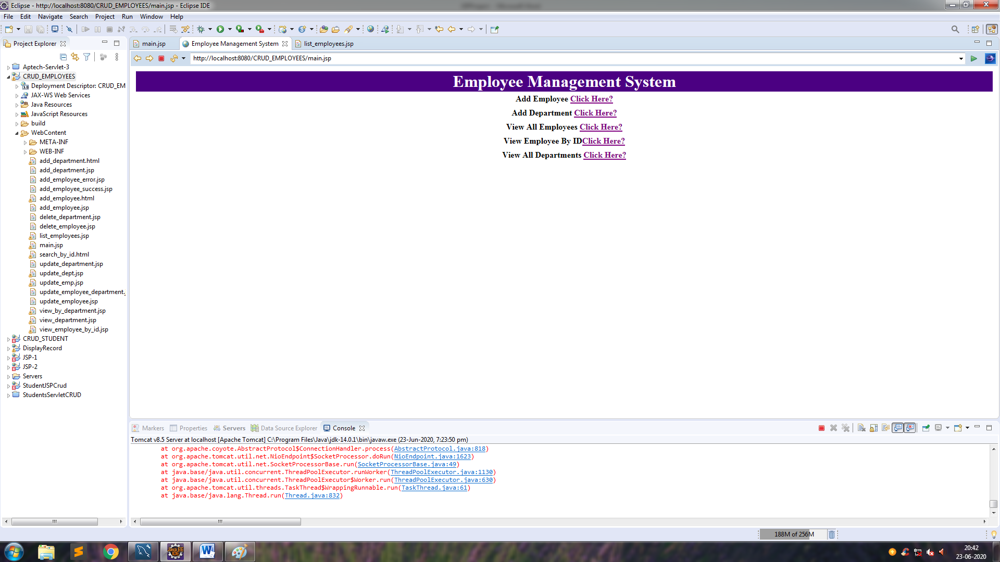
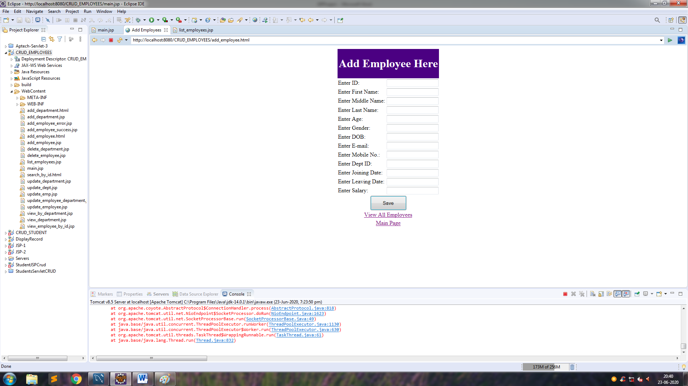
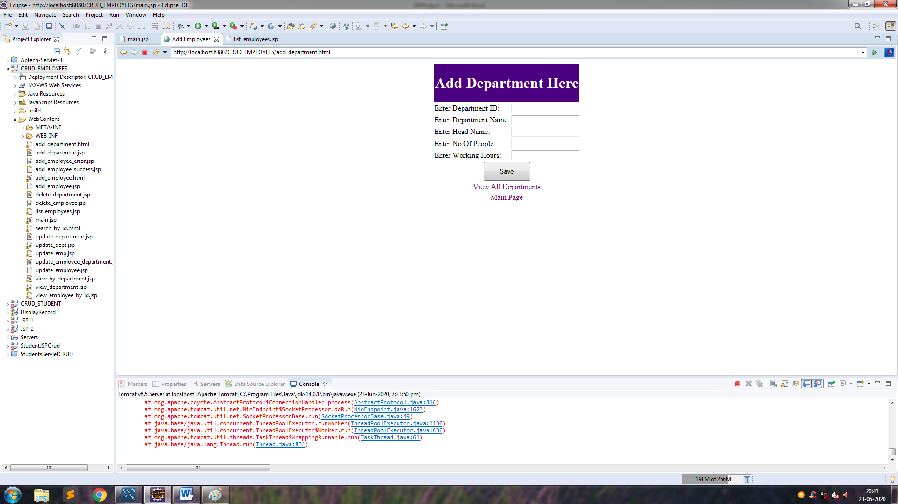
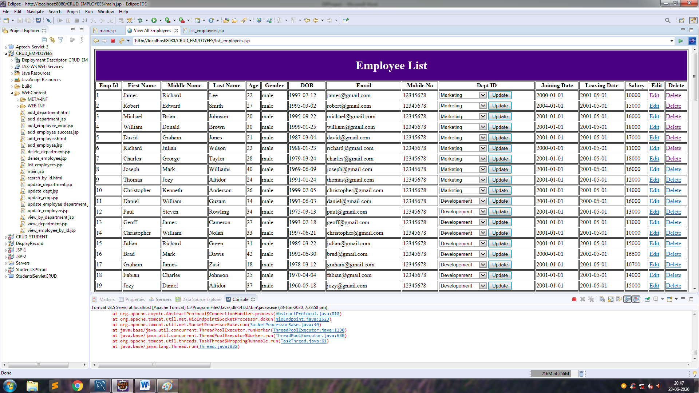
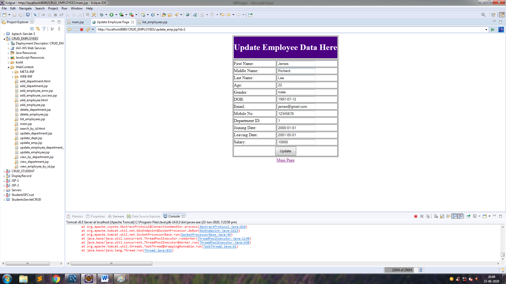
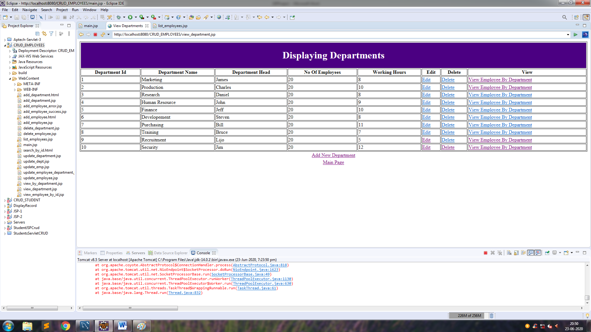
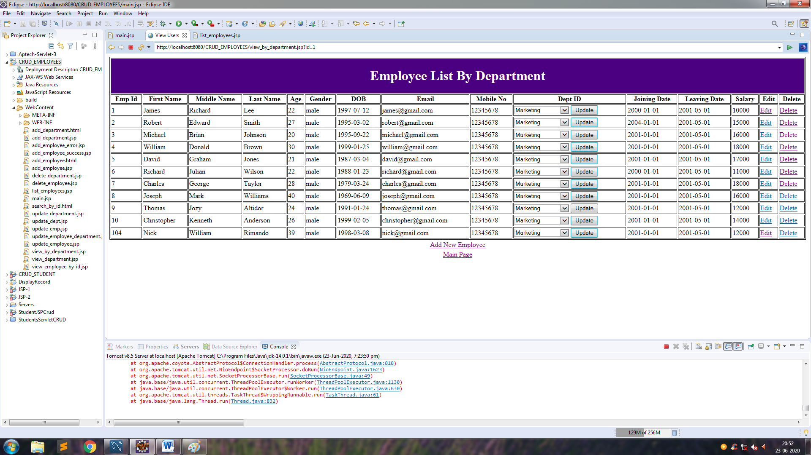

# Employee and Department Managment Using JSP

## This is the demonstration of a simple jsp project which uses mysql as a database and perform **CRUD** operations and is built in **MVC** architecture  

## Main Page 

## First Link: Adding New Employee

## Second Link: Adding New Department

## Third Link : Showing All Employees

## Fourth Link : Showing Employee By ID

## Fifth Link : Displaying Department

